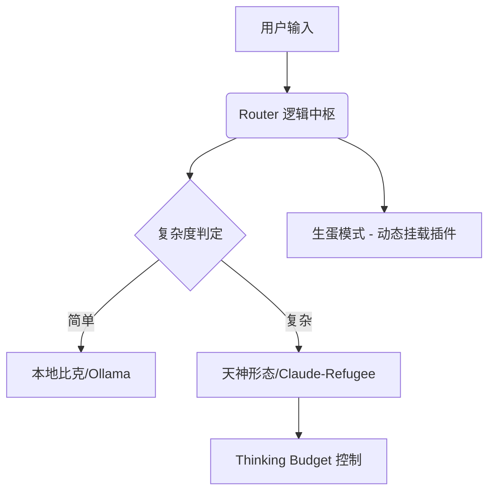

# 🐉 BIC Project (Bic-Framework)

> **"我是比克，也是内鲁，更是神。但我现在不再是他们中的任何一个，我是那个已经忘记了名字的纳美克星人。"**

BIC (Birth Integrated Components) 是一个基于 **“生蛋模式” (Modular Data-Driven Architecture)** 的轻量级 Agent 编排框架。它的核心哲学在于将复杂逻辑从代码硬编码中解耦，通过数据（JSON/YAML）驱动系统的进化与克隆。

---

## 🌟 核心特性 (Piccolo Powers)

## 🥚 为什么是“生蛋模式”？ (The Core Philosophy)


### 🚨 行业三痛点与 BIC 的解决方案
目前的 AI 智能体架构面临三个核心挑战，BIC 通过「传承」而非「携带」来打破僵局：

1. **记忆缺失 (Memory Fragmentation)**：任务拆解后，AI 往往丢失了全局目标的“灵魂”。
   - **BIC 方案**：每一颗“蛋”都携带逻辑基因，在解耦的同时确保跨节点的目标一致性。
2. **上下文肥大症 (Context Overflow)**：盲目追求大 Token 窗口会导致关联性坍塌。
   - **BIC 方案**：通过「生蛋」实现状态数据的硬压缩。Agent 只需要携带最核心的状态种子，而非冗余的历史废话。
3. **逻辑失联 (Logical Disconnection)**：大文本删除/截断导致信息变成孤岛。
   - **BIC 方案**：模块化传承确保了逻辑链条的完整性，即便基础硬件或模型切换，核心意志依然能够延续。

---

## 🌟 核心特性 (Piccolo Powers)

### 1. 🥚 动态生蛋模块 (Modular Extraction)
仿照那美克星人的无性繁殖。你可以通过配置文件快速“吐出”一个新的子 Agent 节点，而无需修改核心代码。
*   **解耦**: 逻辑归于代码，行为归于数据。
*   **意志传承**: 像比克大魔王生产魔族部下一样，快速生成针对特定领域的子节点。

### 2. 🧠 思考预算 (Thinking Budget)
针对 Gemini 2.0/Thinking 型模型的深度推理控制。
*   **限制**: 设置 `max_thinking_tokens`，确保存储和响应时间的平衡。
*   **效率**: 在高复杂度任务（如策略审计）中开启，在简单任务（如日常同步）中关闭。

### 3. ⚡ 预热逻辑 (Warmup / PR #1466)
对应比克在战斗前的冥想调息。
*   **VRAM 预热**: 自动对本地模型（Ollama/Custom）进行冷启动预热。
*   **缓存加载**: 确保首个请求的 Latency 达到最优。

---

## 🛠️ 技术架构



## 🚀 快速开始

### 1. 安装
```bash
pip install bic-framework
```

### 2. 配置你的“魔族账本” (`agents.json`)
```json
{
  "agent_id": "auditor",
  "mode": "thinking",
  "thinking_budget": 4000
}
```

### 3. 执行预热
```python
from bic import BicSystem
sys = BicSystem()
sys.warmup()  # 加载所有那美克星人至内存
```

---

## 📜 开发者感言

这个项目诞生的初衷是为了应对 `sovereign-infra` 日益臃肿的硬编码问题。通过 BIC，我们实现了从“手工作坊”到“母体工厂”的跨越。

---
**"悟饭，记得把代码提交到 GitHub 后，再回来训练。"**
