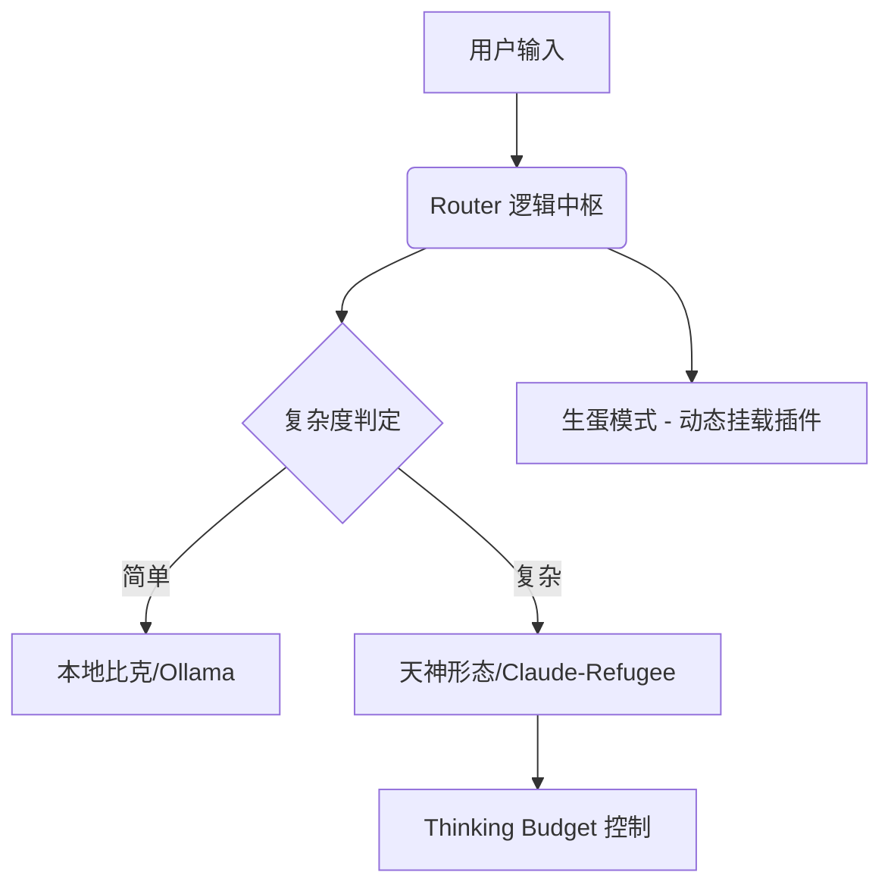

# 🐉 BIC Project (Bic-Framework)

> **"我是比克，也是内鲁，更是神。但我现在不再是他们中的任何一个，我是那个已经忘记了名字的纳美克星人。"**

BIC (Birth Integrated Components) 是一个基于 **“生蛋模式” (Modular Data-Driven Architecture)** 的轻量级 Agent 编排框架。它的核心哲学在于将复杂逻辑从代码硬编码中解耦，通过数据（JSON/YAML）驱动系统的进化与克隆。

---

## 🌟 核心特性 (Piccolo Powers)

## ⚔️ 核心架构理论：基于知识蒸馏的上下文分片 (Context Partitioning via Distillation)

BIC 不仅仅是一个脚手架，它是一套解决 AGI 开发中「上下文瓶颈」的理论实现。

### 1. 解决“单体上下文饱和” (Monolithic Context Saturation)
*   **痛点**：Agent 在处理超大规模项目时，会因为上下文窗口填充过多无关历史信息而导致注意力涣散。
*   **方案**：**基于知识蒸馏的分片**。我们的架构通过自动化脚本将复杂需求拆解为独立的模块单元（子项目）。母系统仅保留核心逻辑与索引，而将具体执行推向「局部上下文」。这在理论上保证了 Agent 在每一个子任务中都能拥有最高的**信噪比**。

### 2. 标准化元数据带来的“零成本对齐” (Zero-Shot Alignment)
*   **痛点**：多智能体或跨会话协作最难的是保持行为准则的一致性。
*   **方案**：通过注入 `json` 格式的基础配置与 `markdown` 格式的标准化规范，BIC 为所有衍生的子模块建立了一套物理级的**强制性先验知识 (Hard Constraints)**。Agent 只要进入文件夹读取到这些元数据，就能瞬间对齐项目风格与安全要求，无需重复学习。

### 3. 历史信息的“递归式压缩” (Recursive History Compression)
*   **痛点**：长期项目中，历史决策的检索成本极高。
*   **方案**：该系统在创建新模块时，通过提取母项目的关键决策路径作为“历史摘要”注入子项目。这是一种高效的知识传递机制，确保了子项目在具备独立性的同时，通过“逻辑链接”维持了与母系统的逻辑闭环。

---

## 🌟 核心特性 (Piccolo Powers)


### 1. 🥚 动态生蛋模块 (Modular Extraction)
实现代码与意识的彻底分离。你可以像比克吐蛋一样，通过数据驱动快速克隆具备特定能力的子 Agent。
*   **解耦**: 逻辑归于代码，行为归于数据。
*   **意志传承**: 通过「分片蒸馏」确保子节点不仅独立，且具备母系统的战术直觉。
仿照那美克星人的无性繁殖。你可以通过配置文件快速“吐出”一个新的子 Agent 节点，而无需修改核心代码。
*   **解耦**: 逻辑归于代码，行为归于数据。
*   **意志传承**: 像比克大魔王生产魔族部下一样，快速生成针对特定领域的子节点。

### 2. 🧠 思考预算 (Thinking Budget)
针对 Gemini 2.0/Thinking 型模型的深度推理控制。
*   **限制**: 设置 `max_thinking_tokens`，确保存储和响应时间的平衡。
*   **效率**: 在高复杂度任务（如策略审计）中开启，在简单任务（如日常同步）中关闭。

### 3. ⚡ 预热逻辑 (Warmup / PR #1466)
对应比克在战斗前的冥想调息。
*   **VRAM 预热**: 自动对本地模型（Ollama/Custom）进行冷启动预热。
*   **缓存加载**: 确保首个请求的 Latency 达到最优。

---

## 🛠️ 技术架构



## 🚀 快速开始

### 1. 安装
```bash
pip install bic-framework
```

### 2. 配置你的“魔族账本” (`agents.json`)
```json
{
  "agent_id": "auditor",
  "mode": "thinking",
  "thinking_budget": 4000
}
```

### 3. 执行预热
```python
from bic import BicSystem
sys = BicSystem()
sys.warmup()  # 加载所有那美克星人至内存
```

---

## 📜 开发者感言

这个项目诞生的初衷是为了应对 `sovereign-infra` 日益臃肿的硬编码问题。通过 BIC，我们实现了从“手工作坊”到“母体工厂”的跨越。

---
**"悟饭，记得把代码提交到 GitHub 后，再回来训练。"**
